# Python Scripting Projects

These python scripting projects are built in correspondence with " [100 Days of Code - The Complete Python Pro Bootcamp](https://www.udemy.com/course/100-days-of-code/) " course. This course was taught by London's App Brewery top instructor Angela Yang.<br/>

Each project has been built from scratch with minimal to no assistance.<br/>

### Day 001 - Band Name Generator

This project generates a band name based on hometown and pet name. Get hometown and pet name as user input.

For a live version, go [here](https://replit.com/@grandeurkoe/band-name-generator?v=1) .

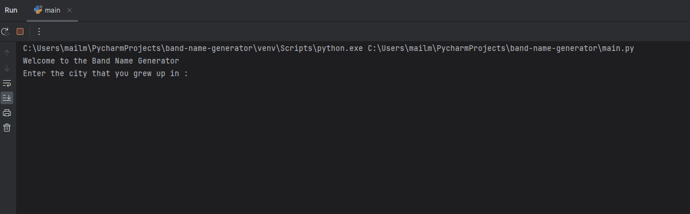

### Day 002 - Tip Calculator

This project calculates tip based on total bill, number of people to split the bill and the tip percentage (10, 12 or 15). Get total bill, number of people to split the bill and the tip percentage as user input.

For a live version, go [here](https://replit.com/@grandeurkoe/tip-calculator?v=1) .

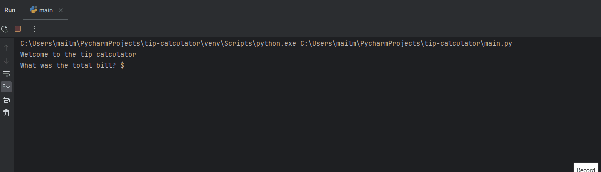

### Day 003 - Treasure Island

This project simulates a simple treasure island game. Navigate **Treasure Island** game based on user input. Possible user inputs are mentioned in the prompt.

For a live version, go [here](https://replit.com/@grandeurkoe/treasure-island?v=1) .

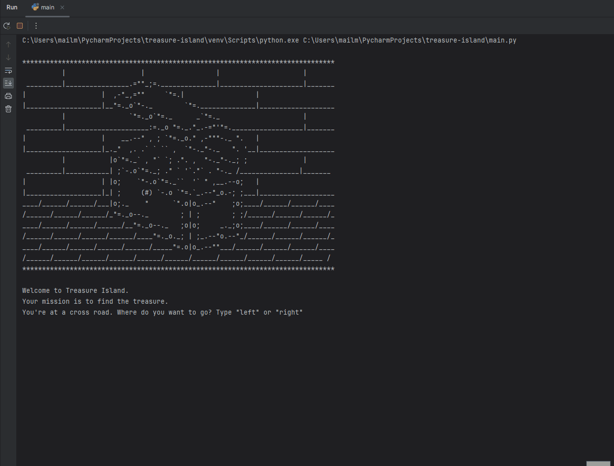

### Day 004 - Rock Paper Scissors

This project simulates a simple rock paper scissors game. Get user choice (Rock/Paper/Scissors) as user input. End game when user either loses, wins or draws.

For a live version, go [here](https://replit.com/@grandeurkoe/rock-paper-scissors?v=1) .

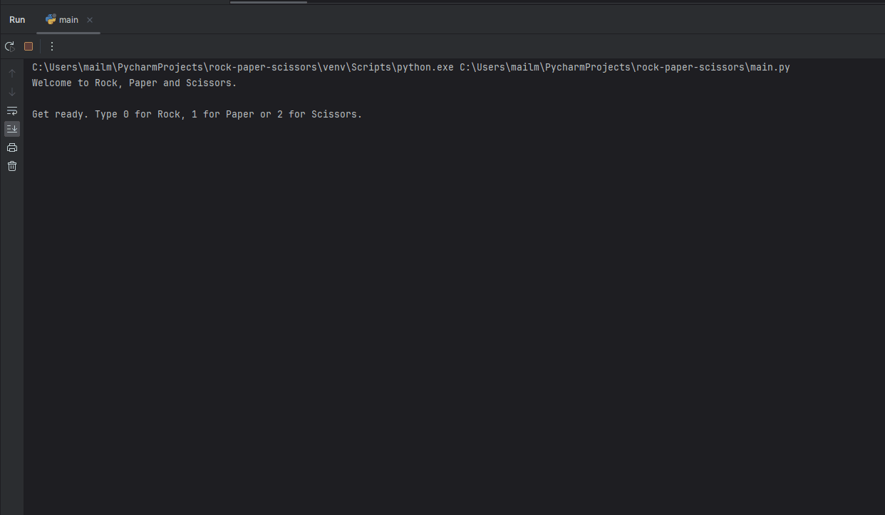

### Day 005 - Password Generator

This project generates a password based on the number of letters, symbols and integers. Get number of letters, symbols and integers as user input.

For a live version, go [here](https://replit.com/@grandeurkoe/password-generator?v=1) .

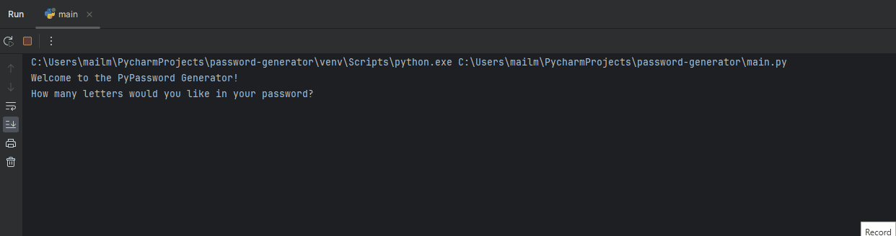

### Day 007 - Hangman Game

This project simulates the hangman game. Get guess letter as user input. If guessed letter is not in chosen word, then reduce lives by 1. End game when number of lives are reduced to 0 or when the user has guessed the chosen word.

For a live version, go [here](https://replit.com/@grandeurkoe/hangman?v=1) .

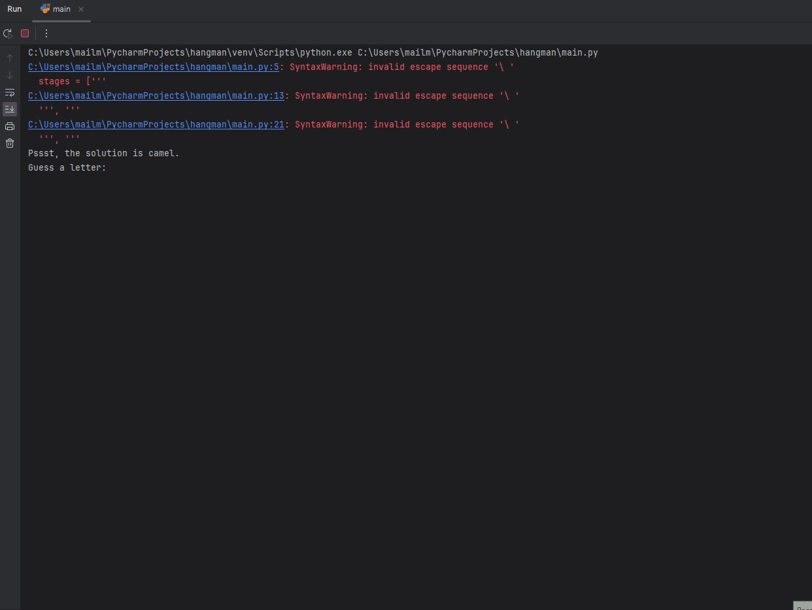

### Day 008 - Caesar Cipher

This project encodes a message based on the shift number. The encoded message can then be decoded using the same shift number. Switch between encode and decode options based on user input. Also, get message, shift number and encoded message as user input.

For a live version, go [here](https://replit.com/@grandeurkoe/caesar-cipher?v=1) .

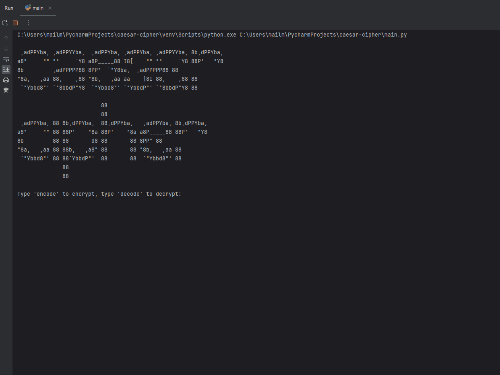

### Day 009 - Secret Auction

This project simulates a secret auction. Get each bidder's name and bid amount as user input. End secret auction when no more bidders exist and display details of bidder with the highest bid. 

For a live version, go [here](https://replit.com/@grandeurkoe/secret-auction?v=1) .

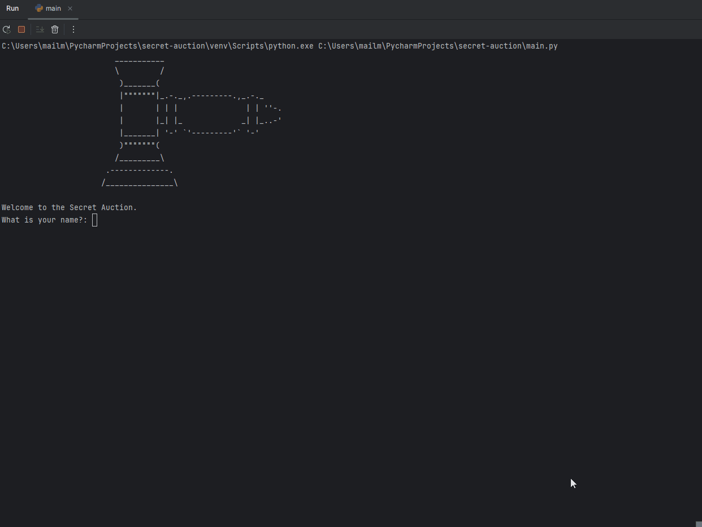

### Day 010 - Calculator

This project simulates a basic calculator. Get first number, operation (+,-,*,/) and next number as user input. Also, continue calculations based on user input.

For a live version, go [here](https://replit.com/@grandeurkoe/calculator?v=1) .

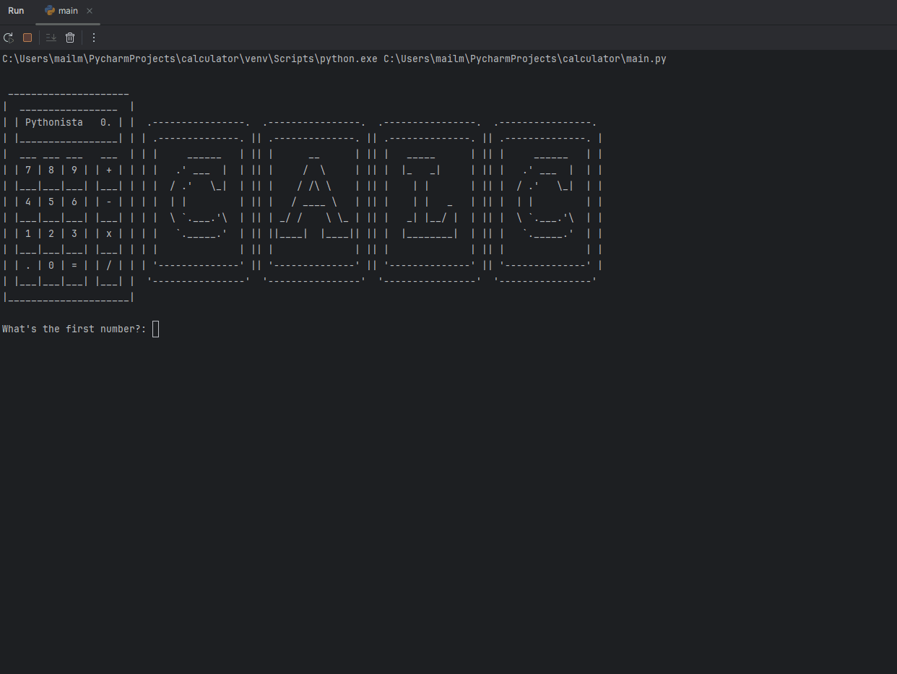

### Day 011 - The Blackjack Game

This project simulates the blackjack game. Generates cards for both user and computer randomly. Calculate user score based on cards drawn. Get user to choose if he wants to draw more cards or not as user input. End game and display the result of blackjack game when either the user or computer wins, draws or loses.

For a live version, go [here](https://replit.com/@grandeurkoe/the-blackjack-capstone-project?v=1) .

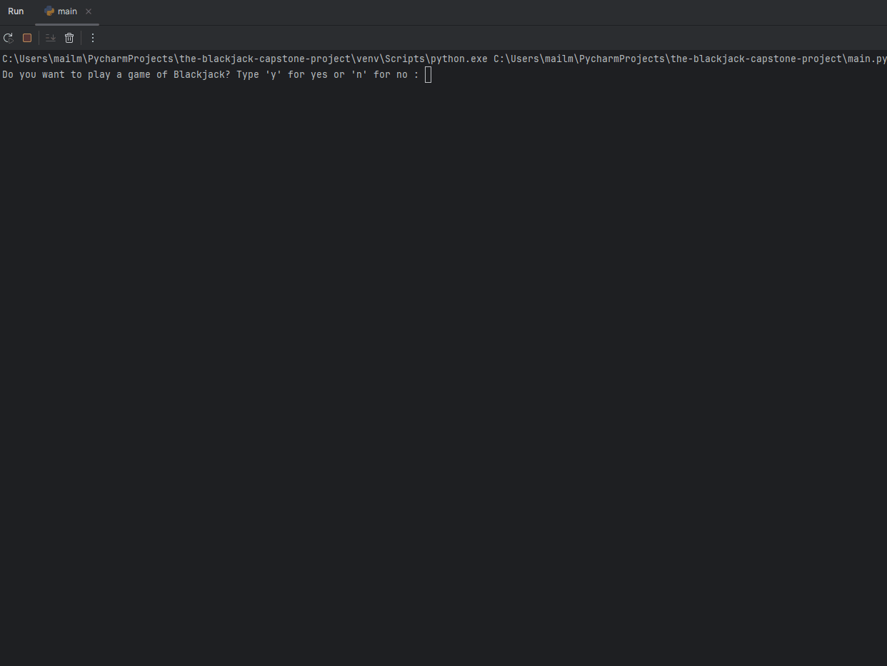

### Day 012 - Number Guessing Game

This project simulates the number guessing game. Choose difficulty option (easy/hard) based on user input. Set number of attempts based on difficulty option. Get guessed number as user input. End game when no more attempts remain.

For a live version, go [here](https://replit.com/@grandeurkoe/number-guessing-game?v=1) .

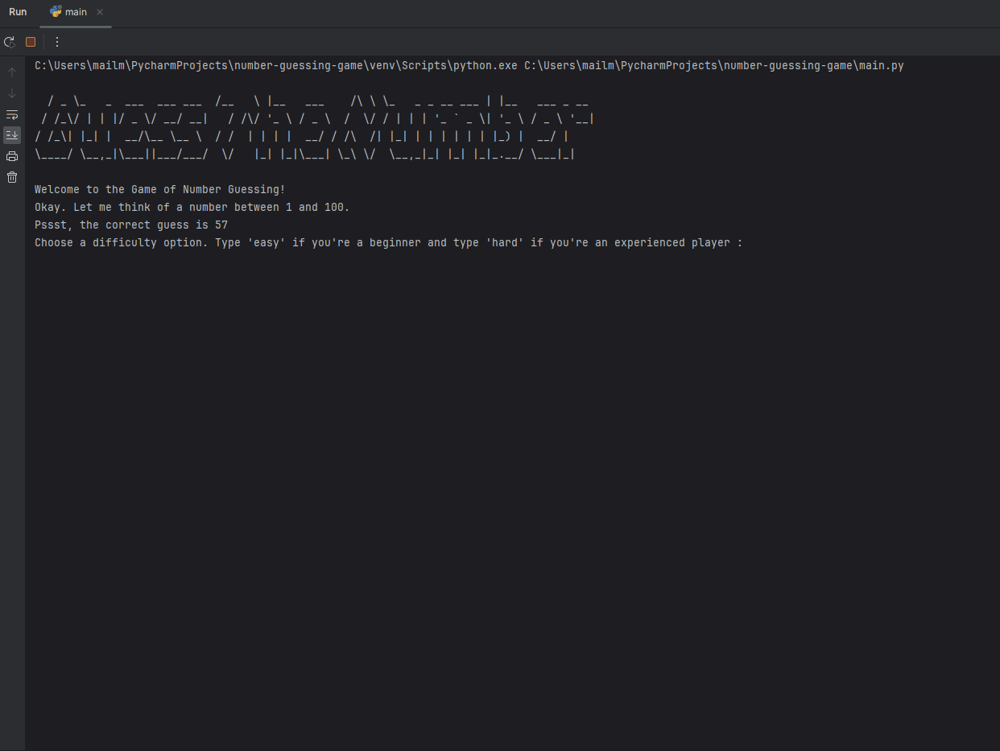

### Day 013 - Debugger

This project involves reproducing bugs, playing computer (debug line by line) and using the debugger to debug code. 

For a live version, go [here](https://replit.com/@grandeurkoe/debugging?v=1) .

### Day 014 - Higher Lower Game

This project simulates the higher lower game. Get two random social account details. Get user to pick one of the two social account (A/B) as user input. Compare number of followers of the two social account. Compare social account with  higher follower count from previous comparison with another random social account. End game when the user picks social account with a lower follower count.

For a live version, go [here](https://replit.com/@grandeurkoe/higher-lower-game?v=1) .

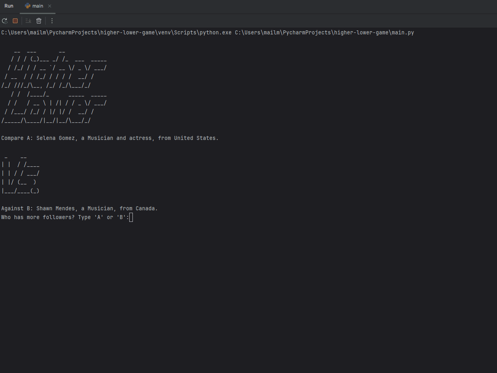

### Day 015 - The Coffee Machine

This project simulates the coffee machine. Get the kind of coffee (espresso/latte/cappuccino) as user input. If user picks one of the coffee kinds, check if the machine has enough resources. If the machine has enough resources, then check if user has enough money (user input). If all checks pass, then add money and subtract resources from the coffee machine. If any of the checks fail, then display what went wrong and end the simulation.

During the "What would you like? (espresso/latte/cappuccino) :" prompt, the user can also pick one of the two hidden prompts:
1. report - Display resources for making coffee and money earned by the coffee machine.
2. off - Turns of the coffee machine.

For a live version, go [here](https://replit.com/@grandeurkoe/the-coffee-machine?v=1) .

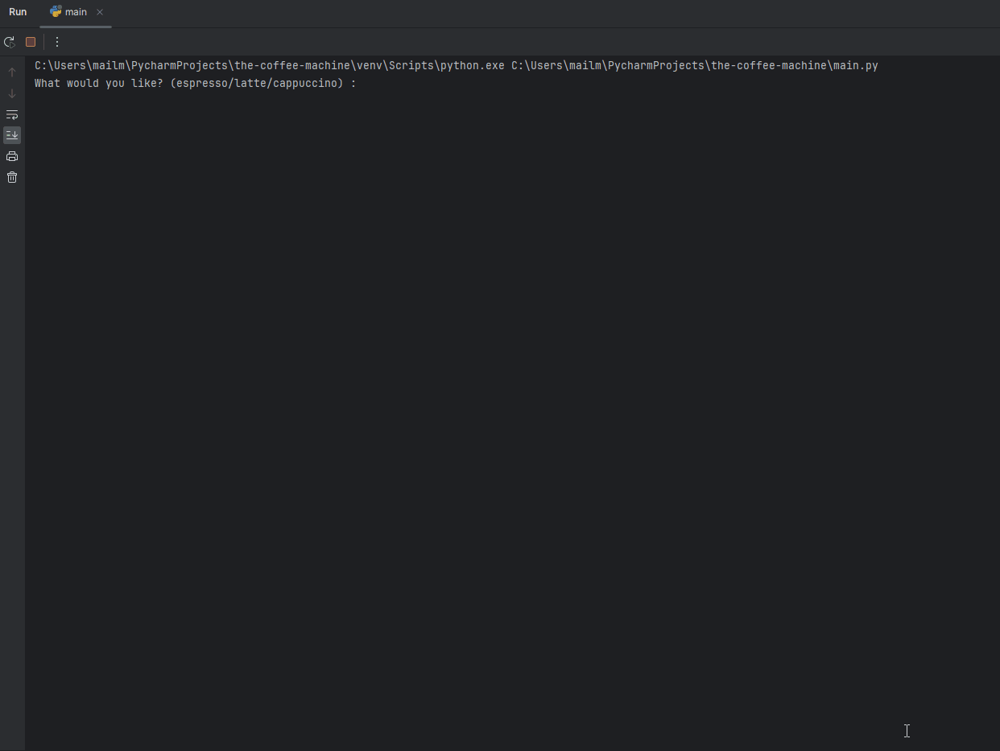

### Day 015 - The Coffee Machine (OOP Version)

This project simulates the coffee machine. This is the OOP Version of the above project.

For a live version, go [here](https://replit.com/@grandeurkoe/the-coffee-machine-oop-version?v=1) .

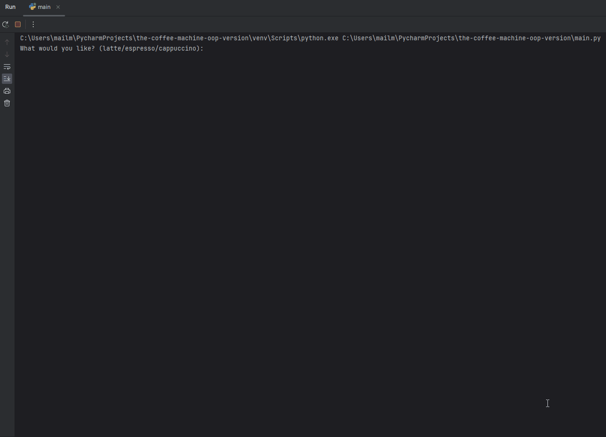

### Day 016 - The Quiz Game

This project simulates the quiz game. Get quiz answer (True/False) as user input. End the quiz game and display user score when no more questions remain.

For a live version, go [here](https://replit.com/@grandeurkoe/the-quiz-game?v=1) .

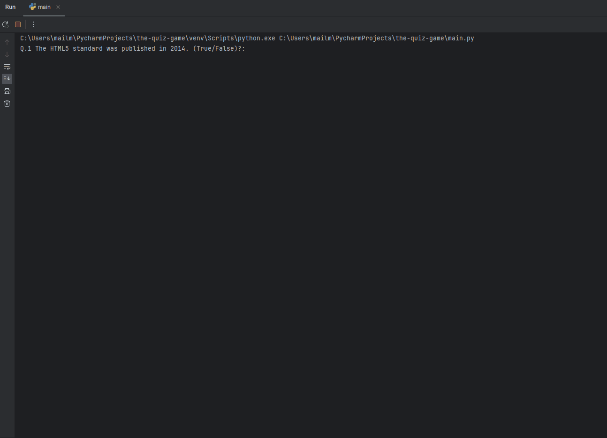

### Day 024 - Mail Merge

This project generates birthday invite letters as text files using contents from other text files. Get birthday invite letter template (starting_letter.txt) and names of invitees (invited_names.txt) from their respective text files. Generate birthday invite letters by replacing [name] in 'starting_letter.txt' with names from 'invited_names.txt'.

For a live version, go [here](https://replit.com/@grandeurkoe/mail-merge-project?v=1) .

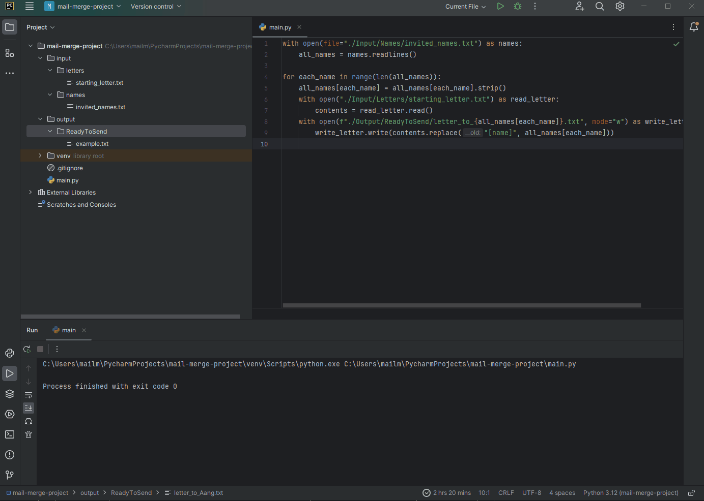

### Day 026 - The NATO Alphabet 	

This project generates the TELEPHONY for a given word (where each individual letter is the NATO Phonetic Alphabet). Read the contents of the "nato_phonetic_alphabet.csv" file using the read_csv() function from the pandas library and store it as a dictionary for quick callback. Get the word for which you want to generate the TELEPHONY as user input. Generate the TELEPHONY for each NATO phonetic alphabet in the word and display it.

For a live version, go [here](https://replit.com/@grandeurkoe/the-nato-alphabet-project?v=1) .

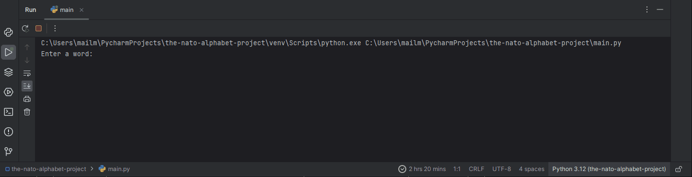

### Day 032 - Automated Birthday Wisher

This project automatically generates and sends a "Happy birthday" email. Get todays date using the datetime module. Read the contents of the "birthdays.csv" file using the read_csv() function from the pandas library and store it as a dictionary for quick callback. If any of the dates in the dictionary matches with today's date, then randomly select a letter template and replace the [name] in the letter template with the birthday boys/girls name (from dictionary). Finally, send an email to the birthday boy/girl using the smtplib library.

For a live version, go [here](https://replit.com/@grandeurkoe/automated-birthday-wisher?v=1) .

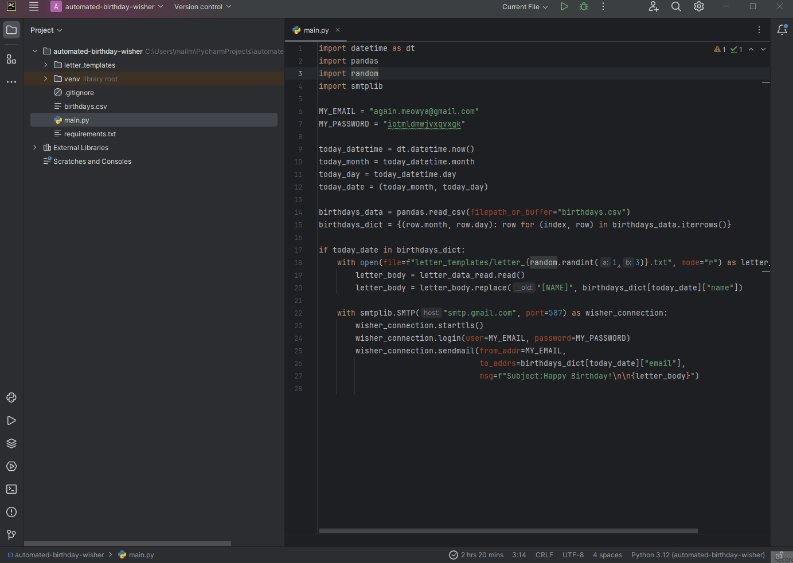

## Getting Started

### Prerequisites

<b>For Windows:</b>
<br/> 

Download and Install the latest version of [Python](https://www.python.org/downloads/).<br/><br/>
Download and Install the latest version of [PyCharm Community Edition](https://www.jetbrains.com/pycharm/download/?section=windows).<br/>


<b>For Linux:</b>
<br/> 

<b>Linux</b> comes preinstalled with Python.<br/><br/>
To install the latest version of PyCharm Community Edition, run the following command:
```
sudo snap install pycharm-community --classic
```

### Installing

You can install all the required packages listed in the requirements.txt file for the project at the same time: 


<b>For Windows:</b>
<br/> 
```
python -m pip install -r requirements.txt
```

## Built With
<p>
  
  
  
  
  
  
</p>

## Authors

*Initial work* - [grandeurkoe](https://github.com/grandeurkoe)
